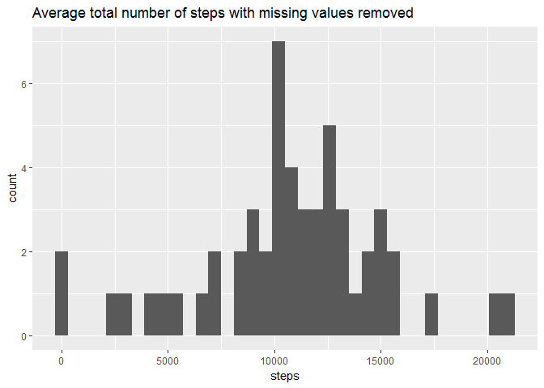
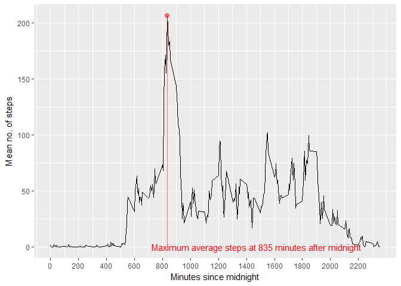
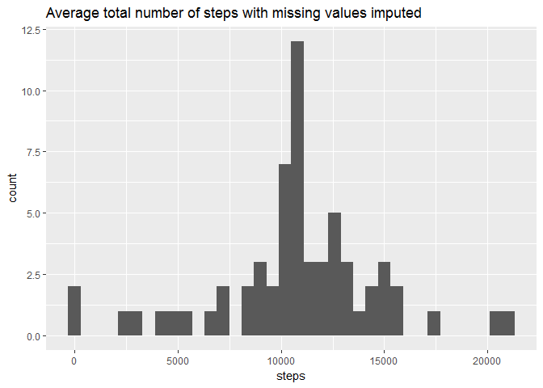
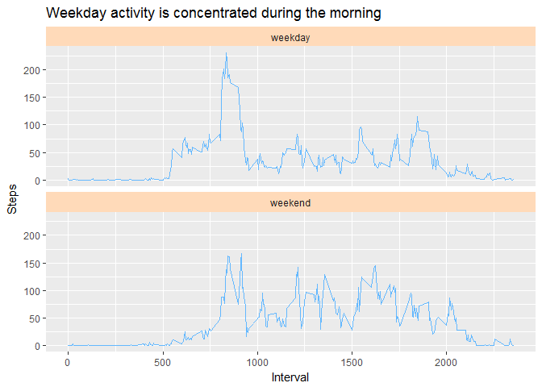

# Reproducible Research: Peer Assessment 1
Meredith Dart  
21 March 2017  


## Loading and preprocessing the data


```r
## unzip file

    unzip("activity.zip", exdir = ".")

## read in data

    activity <- read.csv("activity.csv")
    
## calculate summaries
    tot_steps <- aggregate(steps ~ date, data = activity, FUN = sum, na.rm = TRUE)
    avg_steps_intv <- aggregate(steps ~ interval, data = activity, FUN = mean, na.rm = TRUE)
```

## What is the mean total number of steps taken per day?

The following histogram shows the average total number of steps per day.


```r
## read in libraries
    library(ggplot2)

    ggplot(tot_steps, aes(x = steps)) + geom_histogram(binwidth = 600) + 
        labs(title = "Average total number of steps with missing values removed")
```

<!-- -->

The mean total number of steps per day is 10766.19 and the median total number of steps per day is 10765.

## What is the average daily activity pattern?

The following plot shows the average number of steps taken per day by interval.


```r
    ggplot(aggregate(steps ~ interval, data = activity, FUN = mean)) +
        geom_line(aes(interval, steps)) + 
        scale_x_continuous(breaks = round(seq(min(activity$interval), 
                                              max(activity$interval), by = 200),1)) +
        labs(y = "Mean no. of steps", x = "Minutes since midnight") +
        annotate("pointrange", x = avg_steps_intv[which.max(avg_steps_intv$steps), ]$interval,
                 y = avg_steps_intv[which.max(avg_steps_intv$steps), ]$steps,
                 ymax = avg_steps_intv[which.max(avg_steps_intv$steps), ]$steps,
                 ymin = 0, colour = "red", alpha = 0.5, size = 0.5) +
        annotate("text", x = avg_steps_intv[which.max(avg_steps_intv$steps), ]$interval + 640,
                 y = 0, label = paste("Maximum average steps at", 
                                     avg_steps_intv[which.max(avg_steps_intv$steps), ]$interval,
                                     "minutes after midnight"), colour = "red")
```

<!-- -->

## Imputing missing values

There are 2304 rows with missing data. All of the missing values are in the steps column.
The following code imputes values for the missing data using the average number of steps for each interval across all days. This assumes that most people spread their activity across the day in a typical daily routine but ignores any skew in the data caused by the distribution of missing values.


```r
    activity_c <- activity
    activity_c[is.na(activity_c$steps), "steps"] <- tapply(activity_c$steps,
                                                           activity_c$interval,
                                                           FUN = mean, na.rm = TRUE)
```

The following histogram shows the average total number of steps per day with missing values imputed.


```r
    ggplot(aggregate(steps ~ date, data = activity_c, FUN = sum), aes(x = steps)) +
        geom_histogram(binwidth = 600) + 
        labs(title = "Average total number of steps with missing values imputed")
```

<!-- -->

The mean total number of steps per day is 10766.19 and the median total number of steps per day is 10766.19.

Imputing missing values by the above method has moved the median towards the mean.
    

## Are there differences in activity patterns between weekdays and weekends?

The following panel plot compares weekday and weekend activity.


```r
## create factor column for day type

    activity_c$day.type <- as.factor(with(activity_c, 
                                          ifelse(weekdays(strptime(activity$date, 
                                                                   format = "%Y-%m-%d")) 
                                                 %in% c("Saturday", "Sunday"),
                                                   "weekend", "weekday")))

## plot the data for each level  
    
    ggplot(aggregate(steps ~ interval + day.type, data = activity_c, FUN = mean)) +
        geom_line(aes(interval, steps), colour = "steelblue1") + 
        facet_wrap(~ day.type, ncol = 1) +
        theme(strip.background = element_rect(fill="peachpuff")) +
        labs(y = "Steps", x = "Interval")  +
        labs(title = "Weekday activity is concentrated during the morning")
```

<!-- -->
